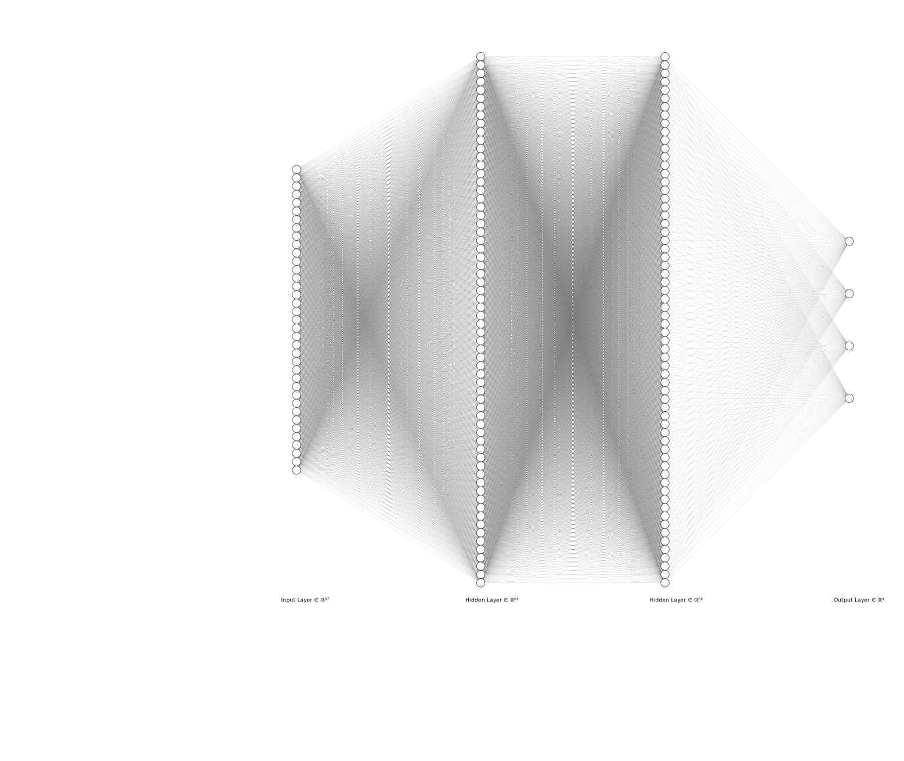
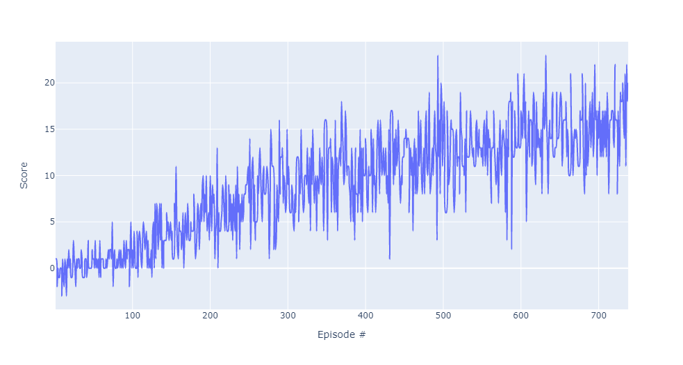
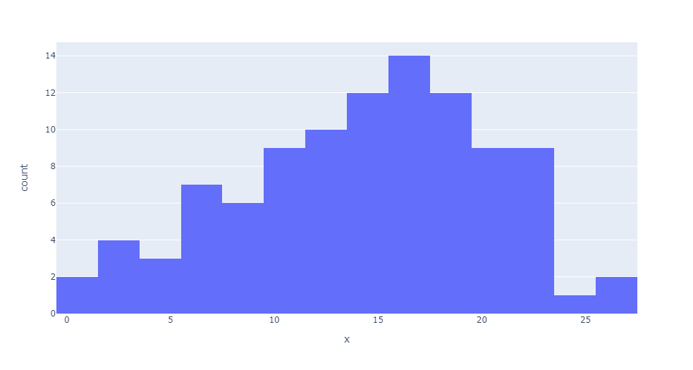

# Navigation with Deep Q-Learning

## Objective

To train an agent to navigate a large, square world while collecting yellow bananas and avoiding blue ones. A reward of +1 is provided for every yellow banana, and a reward of -1 is provided for every blue banana.

The state space has 37 dimensions--35 derived from ray-based perception of objects in the agent's forward diretion (7 raycast angles with 5 measurements each) plus 2 representing the agent's velocity. The action space has four discrete actions: move forward, move backward, turn left, and turn right.

### Requirements

The agent shall achieve an average score ≥ +13 over 100 consecutive episodes.

## Learning Algorithm

This agent uses Deep Q-Learning to solve this environment where the actions taken at each observation are selected from an epsilon-greedy policy that uses a neural network model for its action-value function. This model architecture uses two fully connected hidden layers with ReLU nonlinear activation functions between the state space and the action space as shown in the figure below.

The agent follows the following steps to learn how to navigate the environment:

    Creates a replay memory with capacity N
    Initializes the neural network used to approximate the action-value function
    Initializes another neural network with the same architecture for target values.
    Then for i = 1 to num_episodes
        Gets initial state vector
        Do
            Selects and takes action from epsilon-greedy policy
            Observes next state and reward
            Saves experience tuple (state, action, reward, next state) to replay memory
            Every C steps learns by
                Getting random batch of size M from replay memory
                Computes and optimizes loss with learning rate, LR, using the target network
                updates target network using both the local and target networks weighted by TAU            
        Until episode terminates

where hyperparameters:

*N = 100000* 
*C = 4* 
*M = 64* 
*TAU = 0.001* 
*num_episodes = 2000* 
*epsilon = max(0.01, 0.995(i-1))*

## Results

After 600-700 total episodes the agent was able to achieve an average score of +13. This agent was trained a little longer and after 738 total episodes, the agent was able to achieve an average score ≥ +15. The plot below shows how the agent's score evolved with each episode.

The next plot shows the distribution of scores when the trained agent takes the greedy action over 100 consecutive episodes where *&mu;=14.24* and *&sigma;=6.15*.

## Future Work

The histogram shows that approximately 40% of the episodes still has scores less than +13 and some even as low as 0 so the agent has room for improvement. The ray-based perception forming the state observations returns the nearest object in each of its raycast angles. In some of the low score episodes, the agent was observed stuck in a loop between two actions for the duration of the episode. There are a number of approaches that could improve the agent's performance.

+ Implement a Dueling DQN architecture to use state values in some of those situations and prevent from having to estimate action values for each action.

+ Implement Double DQN architecture to not overestimate action values. For example, the agent could have learned to search for a yellow banana rather than looping between left and right actions in order to avoid moving forward and grabbing a blue banana in low score episodes.

+ Use pixels to train the agent to navigate the environment. The state observations only return the nearest object for each angle. A agent that uses pixels could optimize its navigation to areas with a population density of yellow bananas much greater than blue ones.
