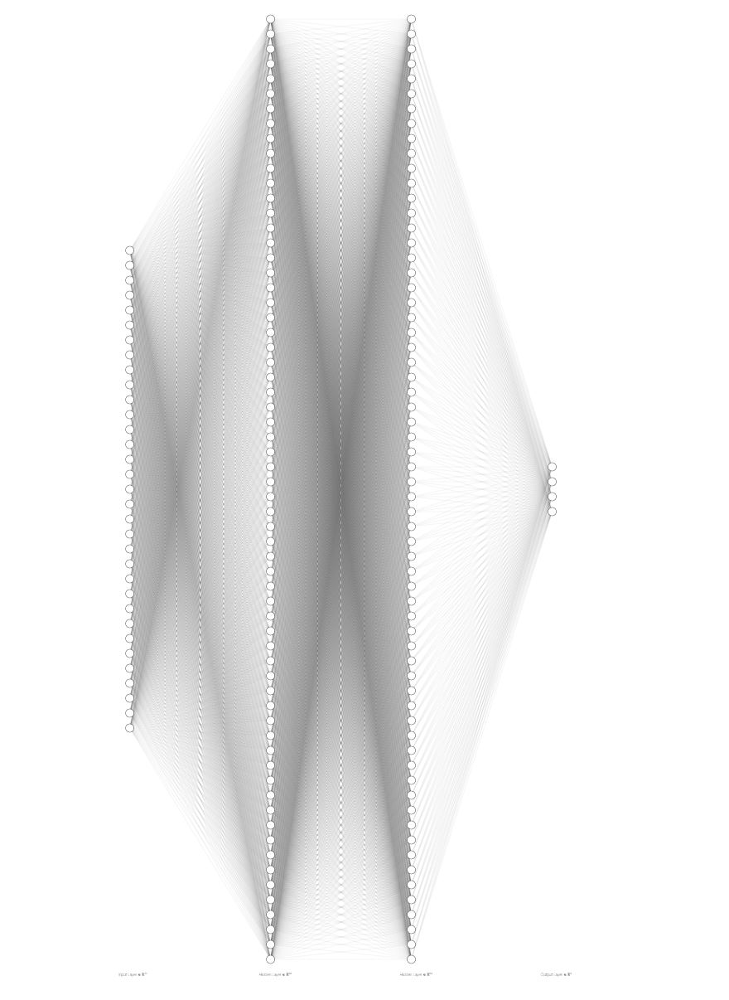
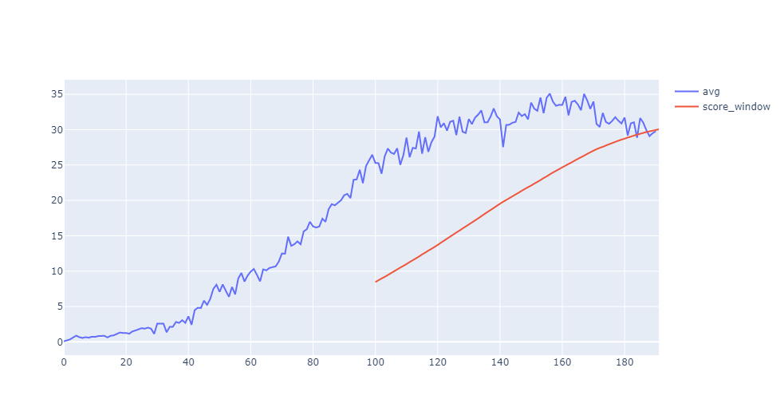
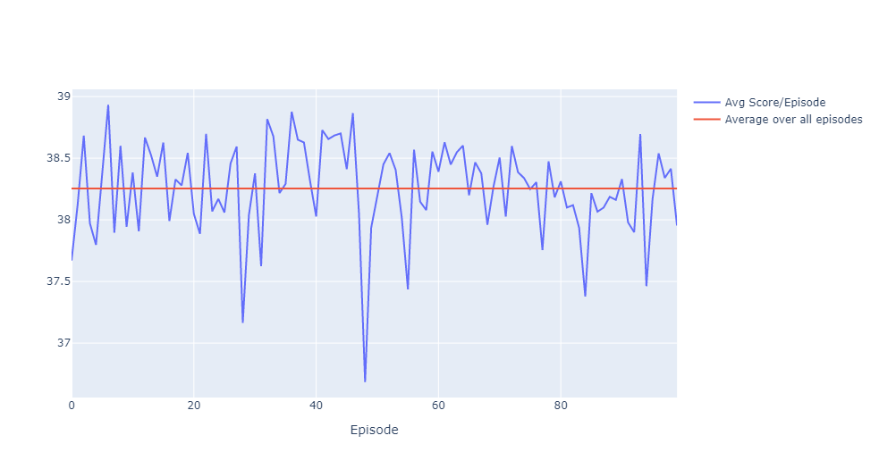

# Continuous Control with DDPG

## Objective

To train an agent to move a double-jointed arm to a target location and maintain the arms position at the target location for as many time steps as possible. Each time step the agent's hand is in the target location, the agent receives a reward of +0.1.

The observation space consists of 33 variables corresponding to position, rotation, velocity, and angular velocities of the arm. Each action is a vector with four numbers, corresponding to torque applicable to two joints. Every entry in the action vector is be a number between -1 and 1.

### Requirements

The agent shall achieve an average score ≥ +30 over 100 consecutive episodes.

## Learning Algorithm

This agent uses the Deep Deterministic Policy Gradients (DDPG) algorithm to solve the environment. The Unity environment where 20 identical agents each with its own copy of the environment was solved with this actor-critic method. Each agent takes an action in their respective environments based on the actor policy model; the critic aims to maximize the value the agent receives.



The agent follows the following steps to learn how to maintain the target position.

    Creates a replay memory with capacity N
    Initializes the local actor neural network used to approximate the policy function
    Initializes the local critic neural network used to approximate Q values
    Initializes two more target neural networks with the same architectures.
    Then for i = 1 to num_episodes
        Gets initial state vector
        Do
            Selects and takes action from current policy with random exploration noise
            Observes next state and reward
            Saves experience tuple (state, action, reward, next state) to replay memory
            Every C steps
                for n times
                    Getting random batch of size M from replay memory
                    Computes and optimizes loss of both the actor and critic with their respective learning rates
                    updates target network using both the local and target networks weighted by TAU
                    decays exploration noise by noise_weight
        Until episode terminates

where hyperparameters:

*N = 100000*
*C = 20*
*n = 10*
*M = 256*
*TAU = 0.001*
*noise_weight = 0.998*
*num_episodes = 2500*

```
NOTE: The noise weight decays to zero after 400 steps to help stabilize the actor-critic learning`
```

### Implementation Details

*Adapted from Section 7 the [DDPG paper](https://arxiv.org/abs/1509.02971)*
Adam was used for learning the neural network parameters with a learning rate of 1e-3 for both the actor and critic models. For Q, a discount factor of 0.99 was used. The actor model uses two fully connected hidden layers with ReLU nonlinear activation functions followed by a fully connected output layer with a hyperbolic tangent activation for the actor vector. Each of these hidden layers had 168 units. The critic model also uses fully connected hidden layers but the action is not input until the second layer. These layers use a leaky ReLU as the activation function. The critic model also encoded the state into 168 units in the first hidden layer. The second hidden layer after the combined encoded state and action also has 168 units. The final layer weights and biases of both the actor and critic models were initialized from a uniform distribution [-3e-3, 3e-3]; the other layers were initialized from a uniform distribution [-&Sqrt;1/f, &Sqrt;1/f], where f is the fan-in of the layer.

## Results

After 91 episodes, the agents were able to achieve an average score of +30. The plot below shows how the average score of the 20 agents evolved with each episode as well as the 100-episode window score.



The next plot shows the average score of the 20 agents over 100 episodes when not actively learning



## Future Work

The plot of the scores during learning shows a dip in average score right before the agent solves the environment. In the future the agent can run beyond the needed episodes to solve the environment to try to better its scores. Also there are a number of approaches that could improve the agent's learning performance.

+ Implement a prioritzed experience replay to help expedite training time and potential stability (if the lower average scores are any indication of that)

+ Substitute the action noise for parameter noise as suggested by [this paper](https://arxiv.org/abs/1706.01905) to try for performance boosts.

+ Extend the DDPG algorithm to Distributed Distributional DDPG (D4PG) to see the effect N-step returns provide.
