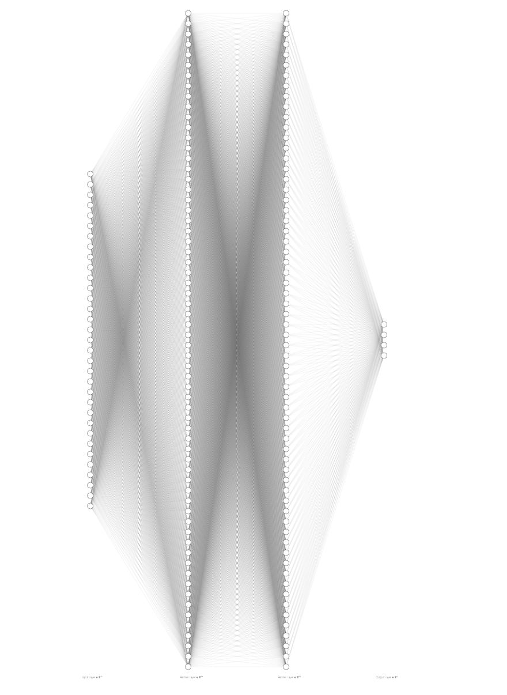
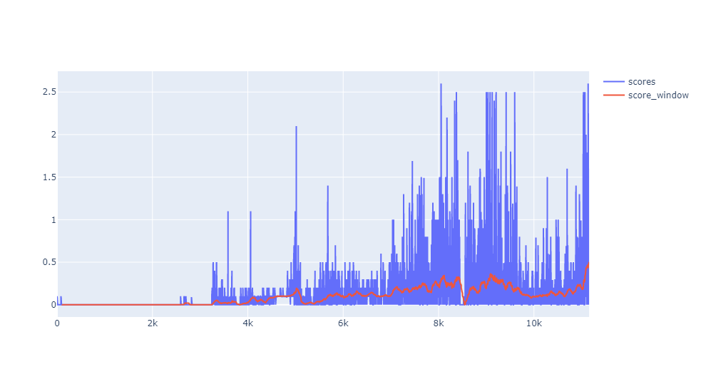

# Multi-agent Collaboration and Competition with DDPG

## Objective

To train two agents controlling rackets to bounce a ball over a net and keep the ball in play for as long as possible. If an agent hits the ball over the net, it receives a reward of +0.1.  If an agent lets a ball hit the ground or hits the ball out of bounds, it receives a reward of -0.01.

The observation space consists of 8 variables corresponding to the position and velocity of the ball and racket. These 8 variables are stacked 3 times into one observation vector resulting in a vector size of 24 representing observations for times *t*, *t-1*, and *t-2*. Each agent receives its own, local observation vector.  Two continuous actions are available, corresponding to movement toward (or away from) the net, and jumping. Every entry in the action vector is a number between -1 and 1.

### Requirements

The agents shall achieve an average score ≥ +0.5 over 100 consecutive episodes.

## Learning Algorithm

This agent uses the Deep Deterministic Policy Gradients (DDPG) algorithm to solve the environment. The Unity environment where 2 identical agents each with its own local observation of the environment was solved with this actor-critic method. Each agent takes an action based on their respective observations using the actor policy model; the critic aims to maximize the value the agents receive.



The agent follows the following steps to learn how to maintain the target position.

    Creates a replay memory with capacity N
    Initializes the local actor neural network used to approximate the policy function
    Initializes the local critic neural network used to approximate Q values
    Initializes two more target neural networks with the same architectures.
    Then for i = 1 to num_episodes
        Gets initial state vector
        Do
            Selects and takes action from current policy with random exploration noise
            Decays exploration noise weight
            Observes next state and reward
            Saves experience tuple (state, action, reward, next state) to replay memory
            Every C steps
                for n times
                    Getting random batch of size M from replay memory
                    Computes and optimizes loss of both the actor and critic with their respective learning rates
                    updates target network using both the local and target networks weighted by TAU
        Until episode terminates

where hyperparameters:

*N = 100000*
*C = 10*
*n = 1*
*M = 512*
*TAU = 0.001*
*noise_weight = 0.998*
*num_episodes = 12000*

```
NOTE: The noise weight decays to zero after 400 steps to help stabilize the actor-critic learning`
```

### Implementation Details

*Adapted from Section 7 the [DDPG paper](https://arxiv.org/abs/1509.02971)*

Adam was used for learning the neural network parameters with a learning rate of 1e-3 for both the actor and critic models. For Q, a discount factor of 0.99 was used. The actor model uses two fully connected hidden layers with ReLU nonlinear activation functions followed by a fully connected output layer with a hyperbolic tangent activation for the actor vector. Each of these hidden layers had 168 units. The critic model also uses fully connected hidden layers but the action is not input until the second layer. These layers use a leaky ReLU as the activation function. The critic model also encoded the state into 168 units in the first hidden layer. The second hidden layer after the combined encoded state and action also has 168 units. The final layer weights and biases of both the actor and critic models were initialized from a uniform distribution [-3e-3, 3e-3]; the other layers were initialized from a uniform distribution [-&Sqrt;1/f, &Sqrt;1/f], where f is the fan-in of the layer.

## Results

After 11057 episodes, the agents were able to achieve an average score of +0.5. The plot below shows how the episode score evolved with each episode as well as the 100-episode window score.



Watching the agents play while not training created a desire for better performance, so the agents continued training beyond the objective of +0.5. A new objective of +1 was used, and after 104 new episodes, the agent achieved the new objective.

## Future Work

The plot of the scores during training shows a slow learning curve, i.e. training took a large number of episodes. There was a long period at the outset that showed no movement above an average score ≥ +0.2. In the future, the agents could continue training to target even higher objective scores, but there is also a number of other approaches that could improve the overall training experience.

+ Implement a prioritized experience replay to help expedite training time and potential stability. *(Notice the dip to < +0.1 near episode 8500.)*

+ Substitute the action noise for parameter noise as suggested by [this paper](https://arxiv.org/abs/1706.01905) to try for performance boosts. Early experiments showed the noise negatively affecting training. Without changing the value of mu, the sampling from a standard normal distribution yielded better performance than the learning agents.

+ Implement Multi-agent DDPG (see [paper](https://arxiv.org/abs/1706.02275)); this algorithm has been shown to improve overall performance and decrease training time by centralizing the agents' critics, i.e. giving each agent information about every other agent's observations and actions.
