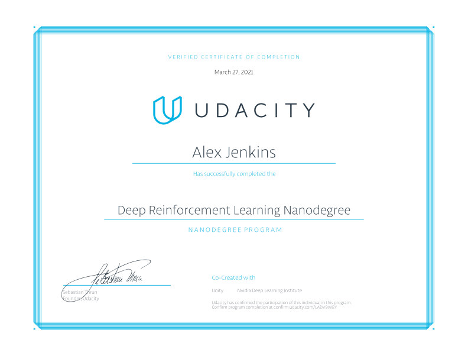

# Deep Reinforcement Learning Nanodegree

This repository contains project work for the Udacity Deep Reinforcement Learning Nanodegree program.

## Projects

### Project 1

An agent is trained to collect yellow bananas while avoiding blue bananas in a large, square world.

### Project 2

An agent is trained to move a double-jointed arm to a target location and keep it there for as long as possible.

### Project 3

Two agents bounce a ball over a net using rackets and collaborate to keep the ball in play.
